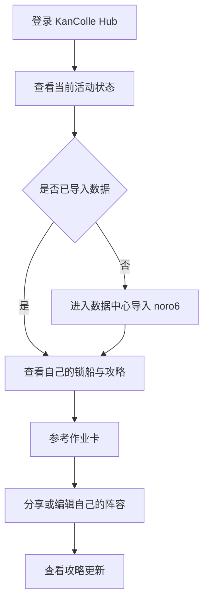
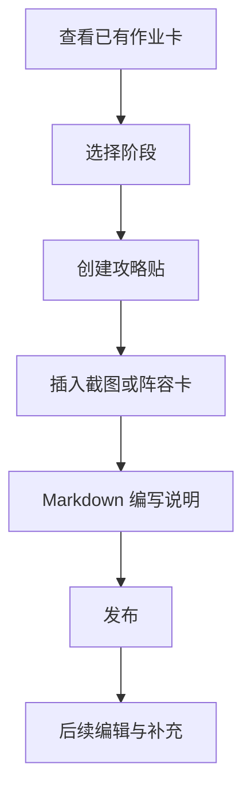
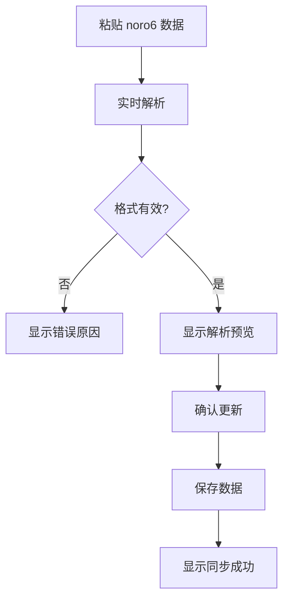
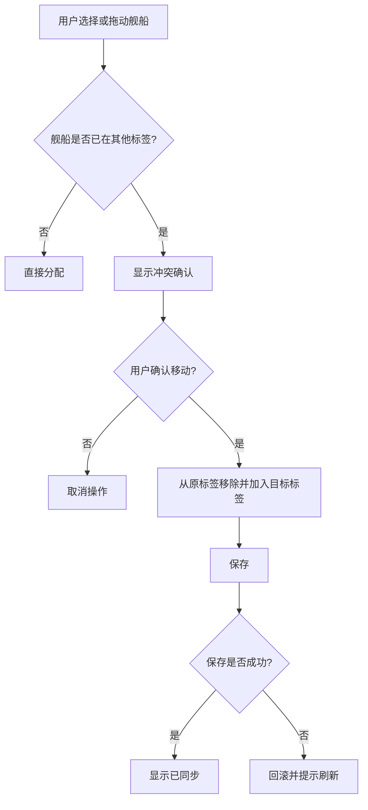

# KanColle Hub GDD（Game / Product Design Document）

> 文档版本：v0.1  
> 文档类型：GDD / 产品体验设计文档  
> 项目名称：KanColle Hub  
> 产品定位：提督小群使用的舰队协作作战台  
> 设计方向：舰桥终端感 / 海图作战板 / 舰籍档案库 / 高信息密度协作工具  
> 目标平台：桌面 Web 优先，移动端支持快速查看与轻量编辑  
> 本文用途：指导后续页面重构、视觉系统、交互设计、功能优先级和内容组织  

---

## 0. 一句话概念

**KanColle Hub 是一个面向小群提督的舰队协作作战台，用于集中管理舰队数据、活动锁船、周回作业卡与攻略档案。**

它不应该像一个普通后台管理系统，也不应该只靠圆角、毛玻璃、阴影获得“现代感”。它的目标气质是：

> **像一套镇守府内部的作战情报终端：克制、硬朗、清晰、高密度、可信。**

---

## 1. 设计愿景

### 1.1 核心愿景

KanColle Hub 的体验应围绕“作战协作”建立，而不是围绕“页面功能列表”建立。

用户打开网站后，应该立刻知道：

1. 当前正在处理哪个活动或日常范围。
2. 自己和其他成员的数据是否准备完毕。
3. 锁船规划是否有冲突或未完成。
4. 最近有哪些作业卡和攻略更新。
5. 下一步最应该做什么。

### 1.2 产品气质

| 维度 | 目标方向 | 避免方向 |
|---|---|---|
| 视觉 | 舰桥终端、海图情报板、工业控制台 | 泛用 Dashboard、过度玻璃拟态 |
| 交互 | 高反馈、低误操作、状态明确 | 点击后无反馈、依赖猜测 |
| 信息密度 | 桌面端高密度但分层清晰 | 卡片堆叠、滚动过长 |
| 协作 | 多人状态清楚、冲突可见 | 谁改了什么不清楚 |
| 趣味性 | 小群氛围、适度舰队主题 | 表情符号滥用、主题压过功能 |
| 移动端 | 查看与轻量修改优先 | 强行塞入桌面矩阵 |

---

## 2. 目标用户

### 2.1 核心用户

#### A. 活动规划者

负责活动期间的锁船、路线、标签、成员数据检查。

需求：

- 快速查看所有人的锁船分配。
- 能发现冲突、漏锁、未上传数据。
- 能根据海域阶段调整标签。
- 能查看他人的舰船池与作业卡。

痛点：

- 活动时间紧，不能在多个工具之间切换。
- 多人协作时容易重复锁船或覆盖修改。
- 群聊里的信息容易被冲掉。

#### B. 普通提督成员

使用网站查看自己该怎么配船、参考他人作业卡、上传自己的数据。

需求：

- 轻松导入 noro6 数据。
- 看到自己当前锁船安排。
- 查看可参考的阵容和攻略。
- 简单分享自己的阵容。

痛点：

- 不知道该先上传数据还是先看攻略。
- 不清楚自己的数据是否被系统识别。
- 移动端查看时信息太拥挤。

#### C. 攻略记录者

负责整理路线、阵容、截图、注意事项。

需求：

- 能快速插入阵容卡。
- 能上传截图。
- 能用 Markdown 记录攻略。
- 能按活动阶段组织内容。

痛点：

- 攻略散落在聊天记录、图片和外部文档。
- 阵容和文字攻略之间缺少关联。
- 后续复盘难找。

#### D. 工具维护者 / 群主

维护活动、标签、主数据、用户数据和权限。

需求：

- 能创建、归档活动。
- 能清理错误标签和过期内容。
- 能避免误删重要数据。
- 能看到系统数据健康状态。

痛点：

- 缺少权限和审计后，误操作难追溯。
- SQLite 单文件部署简单，但备份和迁移需要意识。

---

## 3. 产品目标与非目标

### 3.1 产品目标

1. **降低活动协作成本**  
   把锁船规划、作业卡、攻略、舰队数据集中在一个作战台中。

2. **提升锁船规划的可信度**  
   通过状态提示、冲突检测、保存反馈、活动范围隔离减少误操作。

3. **提高信息扫描效率**  
   让高密度数据能被快速筛选、排序、折叠和定位。

4. **建立独特视觉身份**  
   从泛后台界面升级为“舰队作战终端”。

5. **保持小群工具的轻量性**  
   不追求复杂社区化，不做大型公开平台。

### 3.2 非目标

1. 不做公开大型攻略站。
2. 不做完整社交系统。
3. 不做游戏本体数据抓取或自动化违规工具。
4. 不做复杂实时协同编辑器作为第一阶段目标。
5. 不把个性化装饰置于核心作战体验之上。

---

## 4. 设计支柱

### 4.1 作战终端感

界面要像舰队作战系统，而不是普通管理后台。

表现方式：

- 硬边面板。
- 细线框。
- 大写英文模块名 + 中文主标签。
- 编号、状态灯、数据标签。
- 少量高意义强调色。
- 海图网格、坐标线、终端式标题栏。

### 4.2 高信息密度但可读

KanColle Hub 的数据天然密集，设计目标不是“稀释信息”，而是“建立层级”。

策略：

- 摘要优先，详情可展开。
- 桌面端使用矩阵、表格、紧凑列表。
- 移动端改为分步流程与卡片列表。
- 重要状态固定显示，次要信息悬浮或展开显示。
- 筛选、排序、搜索始终靠近数据。

### 4.3 协作可信

多人小群协作最重要的是“不会乱”。

系统应明确显示：

- 当前活动范围。
- 数据是否已同步。
- 内容是否保存。
- 谁最近修改。
- 是否存在冲突。
- 删除会影响哪些数据。

### 4.4 数据前置

舰队数据是锁船、作业卡、攻略引用的基础。

因此：

- 首页应显示谁已导入数据。
- 数据中心应提供解析预览。
- 未导入数据时应给出清晰引导。
- 锁船页面应明确提示“未导入存档”。

### 4.5 趣味性服务于工具性

签到、小游戏、头像、背景可以保留，但不能挤占作战台的核心信息层级。

建议：

- 主页核心改为作战大厅。
- 头像、背景、签到移入个人侧栏或个人设置。
- 小游戏作为轻量附属功能，不进入核心导航第一层。

---

## 5. 核心体验循环

### 5.1 活动协作主循环


### 5.2 单个成员使用循环



### 5.3 攻略整理循环



---

## 6. 信息架构

### 6.1 推荐一级导航

| 模块名 | 英文系统名 | 说明 |
|---|---|---|
| 作战大厅 | HOME / OPS DASHBOARD | 当前活动状态、成员数据、最近动态、快捷入口 |
| 舰籍数据 | DATA / FLEET REGISTRY | noro6 导入、舰船表、装备库存、主数据状态 |
| 作业卡 | ROUTINE / SORTIE BOARD | 周回记录、阵容编辑、阵容查看、搜索筛选 |
| 攻略档案 | STRATEGY / TACTICAL NOTES | Markdown 攻略、截图、嵌入阵容卡 |
| 锁船矩阵 | LOCK / LOCK MATRIX | 多人锁船规划、标签、冲突、舰船选择 |
| 个人设置 | PROFILE / ADMIRAL STATUS | 头像、背景、个人偏好、签到、小功能入口 |

### 6.2 当前活动上下文

活动不应只是部分页面里的切换器，而应成为全站上下文。

表现：

- 顶栏显示当前活动：`OPERATION: 2026 春活`
- 允许切换日常 / 活动。
- 切换后锁船、作业卡、攻略均使用同一个活动范围。
- 如果进入页面时没有活动上下文，默认日常或最近活动。
- 新建活动应在全站顶栏或作战大厅中可达。

---

## 7. 页面设计

## 7.1 作战大厅

### 7.1.1 页面目标

成为用户每天打开后的第一情报面板。

### 7.1.2 页面结构

1. **Hero / 当前活动**
   - 活动名。
   - 活动范围：日常 / 活动。
   - 当前阶段或备注。
   - 主按钮：进入锁船矩阵。
   - 次按钮：更新舰队数据。

2. **成员数据状态**
   - 已导入人数 / 总人数。
   - 未导入成员列表。
   - 最后更新时间。
   - 快捷提醒或复制提示。

3. **锁船状态**
   - 标签数。
   - 已分配舰船数。
   - 冲突数。
   - 最近修改时间。
   - 进入冲突筛选。

4. **最近作业卡**
   - 最近 3～5 条。
   - 显示海域、任务名、上传者、时间。
   - 支持快速查看。

5. **最近攻略**
   - 最近 3～5 篇。
   - 显示阶段、标题、作者、时间。
   - 支持快速查看。

6. **个人状态**
   - 签到。
   - 食物值。
   - 小游戏入口。
   - 个人设置入口。

### 7.1.3 空状态

如果没有活动：

- 标题：`尚未建立活动档案`
- 文案：`创建一个活动后，锁船、作业卡与攻略将按活动范围独立管理。`
- 主按钮：`创建活动`
- 次按钮：`进入日常模式`

如果没有舰队数据：

- 标题：`舰队数据尚未同步`
- 文案：`导入 noro6 数据后，系统才能识别舰船、装备和锁船状态。`
- 主按钮：`导入舰队数据`

---

## 7.2 舰籍数据 / 数据中心

### 7.2.1 页面目标

完成 noro6 数据导入、解析、查看、对比和舰船/装备检索。

### 7.2.2 核心功能

| 功能 | 说明 | 优先级 |
|---|---|---|
| noro6 数据导入 | 粘贴原始数据或链接 | P0 |
| 解析预览 | 保存前显示舰船数、装备数、未知 ID | P0 |
| 数据保存 | 更新当前用户数据 | P0 |
| 成员视角切换 | 查看其他成员舰队数据 | P1 |
| 舰船表 | 搜索、舰种筛选、等级和属性排序 | P0 |
| 装备表 | 类型筛选、名称搜索、按 ID/星级/数量排序 | P0 |
| 数据更新时间 | 显示最近更新时间 | P1 |
| 导入历史 | 支持回滚或查看旧版本 | P2 |
| 数据差异 | 对比上次导入新增/减少舰船装备 | P2 |

### 7.2.3 导入流程



### 7.2.4 解析预览内容

- 舰船总数。
- 装备总数。
- 不同舰船种类数。
- 未识别舰船 ID。
- 未识别装备 ID。
- 是否包含装备数据。
- 当前数据更新时间。
- 与上次相比新增/减少数量。

### 7.2.5 视觉表现

数据中心应像“舰籍档案库”。

推荐标题：

- `DATA SYNC / 数据同步`
- `FLEET REGISTRY / 舰籍档案`
- `ARSENAL INVENTORY / 装备库存`

样式：

- 少用毛玻璃。
- 表格硬边、紧凑、可读。
- 统计信息使用状态标签。
- 导入框像终端输入区。
- 解析结果像系统报告。

---

## 7.3 锁船矩阵

### 7.3.1 页面目标

支持多人对当前活动或日常范围进行锁船规划，避免冲突并保持标签全局一致。

### 7.3.2 核心功能

| 功能 | 说明 | 优先级 |
|---|---|---|
| 活动范围显示 | 当前活动 / 日常 | P0 |
| 标签管理 | 新增、编辑、停用、排序、颜色 | P0 |
| 多用户锁船矩阵 | 用户 × 标签 | P0 |
| 舰船选择 | 按舰名、ID、舰种、等级筛选 | P0 |
| 单格分配 | 点击空槽位选择舰船 | P0 |
| 拖拽移动 | 同标签排序、跨标签移动 | P0 |
| 替代移动操作 | 移动端或无拖拽环境使用菜单移动 | P1 |
| 冲突检测 | 同一舰船移动到其他标签时确认 | P0 |
| 保存状态 | Saving / Synced / Conflict | P0 |
| 冲突恢复 | 刷新、合并或撤销 | P1 |
| 只看自己 | 快速过滤当前用户 | P1 |
| 只看冲突 | 显示存在冲突或错误的数据 | P1 |
| 操作日志 | 查看最近移动、删除、修改 | P2 |

### 7.3.3 推荐页面结构

1. **顶栏**
   - `LOCK MATRIX / 锁船矩阵`
   - 当前活动。
   - 保存状态。
   - 冲突数。
   - 最近同步时间。

2. **标签阶段栏**
   - 横向显示锁船标签。
   - 标签支持颜色、数量、状态。
   - 新增标签按钮。
   - 标签编辑入口。
   - 删除应改为“停用优先”。

3. **矩阵主体**
   - 左侧 sticky 用户列。
   - 顶部 sticky 标签列。
   - 用户行显示头像、名称、数据状态。
   - 单元格显示舰船条目。

4. **舰船选择面板**
   - 搜索。
   - 舰种筛选。
   - 等级排序。
   - 当前锁船状态。
   - 属性摘要。

5. **底部或右侧状态栏**
   - 保存状态。
   - 冲突提示。
   - 最近操作。
   - 撤销入口。

### 7.3.4 舰船格子信息

| 字段 | 显示方式 |
|---|---|
| 等级 | 左侧小标签，如 `Lv.99` |
| 舰名 | 主文字，单行截断 |
| 舰种 | 右侧小字 |
| 标签色 | 左侧细条或角标 |
| 状态 | 已锁、冲突、未知、数据缺失 |
| 操作 | 移除、移动、查看详情 |

### 7.3.5 冲突流程



### 7.3.6 移动端方案

锁船页移动端不应强行展示完整矩阵。

移动端流程：

1. 默认只显示当前用户。
2. 顶部用标签 Tabs 切换。
3. 当前标签下竖向展示舰船列表。
4. 点击空槽位打开舰船选择。
5. 已分配舰船点击后显示操作菜单：
   - 移动到其他标签。
   - 调整位置。
   - 移除。
   - 查看详情。
6. 提供“查看全员概览”的只读模式。

---

## 7.4 作业卡 / 周回记录

### 7.4.1 页面目标

记录、分享、搜索和复用出击阵容。

### 7.4.2 核心功能

| 功能 | 说明 | 优先级 |
|---|---|---|
| 新建作业卡 | 输入海域、任务名、备注、阵容数据 | P0 |
| 阵容编辑器 | 可视化编辑舰队 | P0 |
| 作业卡列表 | 显示海域、任务、上传者、时间 | P0 |
| 搜索筛选 | 搜索、海域筛选、上传者筛选 | P0 |
| 分页 | 控制列表长度 | P0 |
| 查看模式 | 只读查看别人的阵容 | P0 |
| 编辑模式 | 编辑自己的作业卡 | P0 |
| 复制为新作业 | 基于他人作业创建自己的版本 | P1 |
| 收藏/置顶 | 快速找到常用作业 | P1 |
| 按海域分组 | E1/E2/E3 分组 | P1 |
| 自动保存反馈 | 显示保存状态和时间 | P1 |

### 7.4.3 状态模式

作业卡页面必须明确显示当前模式：

| 模式 | 页面提示 |
|---|---|
| 新建 | `NEW SORTIE CARD / 新建作业卡` |
| 查看 | `VIEW SORTIE CARD / 查看作业卡` |
| 编辑 | `EDIT SORTIE CARD / 编辑作业卡` |
| 自动保存中 | `SAVING...` |
| 已保存 | `SYNCED 12:30` |
| 错误 | `SAVE FAILED` |

### 7.4.4 推荐列表项

每张作业卡显示：

- 海域：`E2-3`
- 任务名：`P1 削甲`
- 上传者。
- 制空值。
- 舰队预览。
- 备注摘要。
- 更新时间。
- 操作：查看 / 复制 / 编辑 / 删除。

---

## 7.5 攻略档案

### 7.5.1 页面目标

提供可持续编辑的活动攻略档案，并能嵌入作业卡和截图。

### 7.5.2 核心功能

| 功能 | 说明 | 优先级 |
|---|---|---|
| 发布攻略 | 阶段、标题、Markdown 内容 | P0 |
| 编辑攻略 | 作者可编辑 | P0 |
| 删除攻略 | 作者或管理员删除 | P0 |
| Markdown 渲染 | 标题、列表、引用、代码、链接 | P0 |
| 插入截图 | 上传图片并插入 | P0 |
| 插入阵容卡 | 将作业卡嵌入攻略 | P0 |
| 按阶段分组 | E1/E2/P1/P2 分组 | P0 |
| 实时预览 | 左编辑右预览 | P1 |
| 攻略模板 | 路线、配装、基地、支援、注意事项 | P1 |
| 目录导航 | 根据标题生成目录 | P1 |
| 版本记录 | 查看修改历史 | P2 |
| 评论/补充 | 小群成员补充说明 | P2 |

### 7.5.3 攻略模板

默认模板：

```md
## 路线

## 配装思路

## 基地航空队

## 支援舰队

## 注意事项

## 参考阵容
```

### 7.5.4 嵌入内容

| Token | 用途 |
|---|---|
| `[img:url]` | 插入截图 |
| `[card:id]` | 插入作业卡 |
| 后续可扩展 `[ship:id]` | 插入舰船引用 |
| 后续可扩展 `[equip:id]` | 插入装备引用 |

### 7.5.5 视觉表现

攻略页应像“战术档案库”：

- 阶段标题 sticky。
- 攻略卡硬边面板。
- 作者和更新时间作为档案元信息。
- 嵌入阵容卡像附录资料，而不是普通卡片。
- 图片有边框和编号。

---

## 7.6 活动管理

### 7.6.1 页面目标

管理活动范围，并保证锁船、作业卡、攻略按活动隔离。

### 7.6.2 功能

| 功能 | 说明 | 优先级 |
|---|---|---|
| 创建活动 | 输入活动名 | P0 |
| 切换活动 | 在顶栏或页面切换 | P0 |
| 活动归档 | 活动结束后隐藏但保留数据 | P1 |
| 活动排序 | 当前活动置顶 | P1 |
| 活动描述 | 记录活动备注 | P1 |
| 活动复盘 | 汇总攻略、作业、锁船结果 | P2 |

### 7.6.3 活动命名建议

- `2026 春活`
- `2026 夏活`
- `日常`
- `EO / 季任`
- `练习规划`

---

## 7.7 个人设置

### 7.7.1 页面目标

承载个性化与非核心功能，不干扰作战大厅。

### 7.7.2 功能

| 功能 | 说明 |
|---|---|
| 头像设置 | 上传或替换头像 |
| 背景设置 | 上传背景图 |
| 背景可读性 | 遮罩强度、模糊、亮度 |
| 签到 | 每日签到与食物值 |
| 小游戏入口 | Dino、Survivor、Invaders |
| 数据导出 | 导出个人数据 |
| 注销/退出 | 退出账号 |

### 7.7.3 背景图规则

用户背景图可以保留，但必须加可读性保护：

- 默认遮罩。
- 亮度限制。
- 背景模糊开关。
- 面板实底优先。
- 禁止背景影响表格和锁船矩阵可读性。

---

## 8. 交互设计规范

## 8.1 状态反馈

每个关键操作必须有反馈。

| 操作 | 反馈 |
|---|---|
| 保存锁船 | Saving → Synced / Conflict |
| 导入数据 | Parsing → Preview → Saved |
| 上传图片 | Uploading → Inserted / Failed |
| 删除标签 | 二次确认，显示影响范围 |
| 编辑攻略 | 保存成功提示 |
| 自动保存 | 显示最近保存时间 |
| 发生冲突 | 弹窗 + 状态栏 + 刷新/合并建议 |

### 8.2 删除确认

禁止高风险操作只用浏览器 `confirm`。

高风险操作包括：

- 删除锁船标签。
- 删除作业卡。
- 删除攻略。
- 归档活动。
- 清空数据。

确认弹窗应包含：

1. 操作对象。
2. 影响范围。
3. 是否可恢复。
4. 明确按钮文案：`确认删除` / `取消`
5. 高风险时输入对象名称确认。

### 8.3 Undo

适合提供撤销的操作：

- 移动舰船。
- 移除舰船。
- 删除作业卡。
- 删除攻略。
- 停用标签。

实现优先级：

- P1：前端短时撤销。
- P2：后端软删除支持恢复。

### 8.4 搜索与筛选

搜索框应遵守：

- 搜索结果即时反馈。
- 输入为空时显示全部。
- 提供清除按钮。
- 大数据量使用延迟搜索。
- 搜索状态应保留在 URL 或页面状态中。

### 8.5 键盘与无障碍

基础要求：

- 所有按钮可键盘聚焦。
- Focus 状态清楚。
- 表单字段有 label 或 aria-label。
- 弹窗可 Esc 关闭。
- 删除确认默认不聚焦危险按钮。
- 颜色状态必须有文字辅助。

---

## 9. 视觉设计规范

## 9.1 视觉关键词

- Fleet Console
- Operation Board
- Tactical Archive
- Registry
- Terminal
- Grid
- Signal
- Status
- Hard Surface
- Low Saturation

中文关键词：

- 舰桥
- 作战台
- 海图
- 档案
- 终端
- 矩阵
- 状态灯
- 指令按钮

## 9.2 参考方向

| 来源 | 可借鉴点 | 不应照搬 |
|---|---|---|
| 明日方舟官网 | 工业感、情报终端、大写英文、硬边分隔 | 不照搬具体素材、Logo、角色视觉 |
| 终末地官网 | 前线、开拓、工业系统感 | 不照搬具体世界观设定 |
| Apple 官网 | 克制版式、单一主题区块、清晰 CTA | 不把工具页做成营销页 |

## 9.3 颜色系统

### 基础色

| Token | 用途 | 方向 |
|---|---|---|
| `bg-base` | 页面背景 | 极深海军蓝 |
| `bg-panel` | 主面板 | 深灰蓝 |
| `bg-panel-subtle` | 二级面板 | 冷灰蓝 |
| `border-base` | 普通边框 | 低透明蓝灰 |
| `text-main` | 主文字 | 灰白 |
| `text-muted` | 辅助文字 | 蓝灰 |
| `primary` | 主操作 | 电信号蓝 |
| `success` | 成功/同步 | 雷达绿 |
| `warning` | 警告/注意 | 琥珀橙 |
| `danger` | 危险/删除 | 低饱和红 |

### 使用规则

- 颜色服务状态，不服务装饰。
- 标签色只用于识别，不应整块铺满造成干扰。
- 主操作色一个页面最多一个。
- 危险色只用于删除、冲突、错误。

## 9.4 字体层级

| 层级 | 用途 | 建议 |
|---|---|---|
| Display | 首页 Hero | 32～48px |
| Page Title | 页面标题 | 24～32px |
| Section Title | 区块标题 | 16～20px |
| Body | 正文 | 14～16px |
| Data | 表格/格子 | 12～14px |
| Meta | 元信息 | 10～12px |
| Code/ID | 编号、ID、状态 | 等宽字体 |

推荐中英混排：

```txt
LOCK MATRIX
锁船矩阵
```

或：

```txt
01 / FLEET REGISTRY
舰籍档案
```

## 9.5 组件风格

### Panel 面板

替代泛用毛玻璃卡片。

特征：

- 小圆角或直角。
- 1px 边框。
- 无或极弱阴影。
- 标题栏。
- 角标或编号。
- 背景实色优先。

### Button 指令按钮

类型：

| 类型 | 用途 |
|---|---|
| Primary | 页面主行动 |
| Secondary | 次行动 |
| Outline | 工具操作 |
| Ghost | 低权重操作 |
| Danger | 删除/危险操作 |

交互：

- 不建议 hover 上浮。
- 使用边框亮度、背景亮度、状态条变化。
- Loading 状态必须禁用重复点击。

### Badge 状态标签

格式建议：

```txt
SYNCED / 已同步
CONFLICT / 冲突
NO DATA / 未导入
LOCKED / 已锁定
DRAFT / 草稿
```

### Table 表格

- Sticky 表头。
- 紧凑行高。
- Hover 行高亮。
- 数字使用等宽或 tabular nums。
- 排序状态清楚。
- 空结果显示清晰提示。

### Dialog 弹窗

- 用于确认、选择、编辑。
- 标题明确。
- 内容说明影响。
- 主操作和取消按钮区分明显。
- 危险操作按钮在视觉上明确但不默认诱导点击。

## 9.6 动效方向

适合：

- 面板切入。
- 细线展开。
- 状态灯闪烁。
- 保存状态切换。
- 数字递增。
- 拖拽吸附。
- 筛选结果过渡。

避免：

- 过多弹跳。
- 大面积玻璃模糊动画。
- 与功能无关的炫技动效。
- 影响数据读取的背景动画。

---

## 10. 文案规范

## 10.1 命名体系

| 当前常见名称 | 建议名称 |
|---|---|
| 数据中心 | 舰籍数据 / Fleet Registry |
| 周回记录 | 作业卡 / Sortie Board |
| 攻略贴 | 攻略档案 / Tactical Notes |
| 锁船总览 | 锁船矩阵 / Lock Matrix |
| 页面背景 | 个人背景 / Console Background |
| 新活动 | 建立活动档案 |

## 10.2 操作文案

| 场景 | 推荐文案 |
|---|---|
| 保存中 | `正在同步...` |
| 保存成功 | `已同步` |
| 保存失败 | `同步失败，请重试` |
| 冲突 | `该锁船计划已被其他成员更新` |
| 未导入数据 | `该提督尚未同步舰队数据` |
| 删除标签 | `停用标签` 优先于 `删除标签` |
| 新建攻略 | `建立战术档案` |
| 插入阵容 | `插入作业卡` |

## 10.3 错误文案原则

错误文案要回答：

1. 发生了什么。
2. 为什么可能发生。
3. 用户下一步该做什么。

示例：

```txt
同步失败：该锁船计划已被其他成员更新。
请刷新页面后查看最新状态，或复制当前修改后重新提交。
```

---

## 11. 响应式设计

## 11.1 桌面端

桌面端是主要作战环境。

优先支持：

- 高密度矩阵。
- 表格。
- 双栏编辑。
- Sticky 标题和列。
- 拖拽操作。
- 快捷键。

## 11.2 平板端

适合查看和轻量编辑。

策略：

- 保持双栏但减少侧栏宽度。
- 锁船矩阵可横向滚动。
- 重要状态固定顶部。

## 11.3 移动端

移动端不追求完整桌面体验。

重点：

- 查看当前活动状态。
- 查看自己的锁船。
- 快速导入数据。
- 查看作业卡和攻略。
- 轻量编辑自己的作业卡或锁船。

不推荐：

- 在移动端展示完整多人矩阵。
- 强依赖拖拽。
- 密集表格无转换。

---

## 12. 数据与隐私设计

### 12.1 数据可见性

默认小群内部可见：

- 用户名。
- 头像。
- 舰船数据。
- 锁船计划。
- 作业卡。
- 攻略贴。

需要明确：

- 谁能查看全部成员数据。
- 谁能编辑公共标签。
- 谁能删除别人的内容。
- 是否允许导出个人数据。

### 12.2 权限建议

| 角色 | 权限 |
|---|---|
| 普通成员 | 管理自己的数据、作业卡、攻略、锁船 |
| 规划者 | 管理锁船标签、活动、查看全员状态 |
| 管理员 | 用户管理、删除恢复、主数据更新、系统设置 |

第一阶段可以先不做复杂角色，但高风险操作应为后续权限预留接口。

---

## 13. 成功指标

### 13.1 可用性指标

| 指标 | 目标 |
|---|---|
| 新成员完成数据导入时间 | 1 分钟内 |
| 从首页进入当前锁船矩阵 | 1 次点击 |
| 找到某张作业卡 | 10 秒内 |
| 判断谁未导入数据 | 5 秒内 |
| 移动舰船并确认保存 | 3 秒内 |
| 误删标签概率 | 接近 0 |

### 13.2 产品价值指标

| 指标 | 说明 |
|---|---|
| 活动期间日活跃成员数 | 小群是否真的在用 |
| 作业卡数量 | 阵容沉淀能力 |
| 攻略贴数量 | 信息整理能力 |
| 锁船冲突处理次数 | 系统是否有效避免错误 |
| 数据导入覆盖率 | 成员数据准备程度 |

---

## 14. MVP 范围

### 14.1 P0：核心可用版本

必须完成：

- 登录与用户识别。
- noro6 数据导入。
- 舰船/装备查看。
- 活动切换。
- 锁船标签管理。
- 多用户锁船矩阵。
- 舰船选择与冲突确认。
- 作业卡新建、查看、编辑、删除。
- 攻略发布、Markdown、截图、嵌入作业卡。
- 基础保存状态与错误提示。

### 14.2 P1：体验完善版本

建议完成：

- 作战大厅。
- 全站活动上下文。
- 统一作战终端视觉系统。
- 锁船矩阵 sticky 行列。
- 移动端替代操作。
- Toast / 状态栏。
- 删除确认弹窗。
- 攻略实时预览。
- 作业卡复制为新作业。
- 数据导入解析预览。

### 14.3 P2：协作增强版本

后续完成：

- 操作日志。
- 软删除和恢复。
- 攻略版本历史。
- 活动归档与复盘。
- 用户权限。
- 数据差异对比。
- 虚拟列表和性能优化。
- 数据导出。

---

## 15. 风险与应对

| 风险 | 影响 | 应对 |
|---|---|---|
| 信息密度过高 | 新用户难上手 | 首页引导、分层、默认只显示核心 |
| 过度主题化 | 可读性下降 | 主题服务功能，表格和矩阵优先可读 |
| 多人覆盖修改 | 数据丢失 | 乐观锁、冲突提示、操作日志 |
| 移动端难用 | 使用场景受限 | 移动端单用户、分标签、轻编辑 |
| 背景图影响阅读 | 数据不可读 | 遮罩、模糊、实底面板 |
| SQLite 扩展性有限 | 并发和部署受限 | 保留迁移 PostgreSQL 路径 |
| 图片上传滥用 | 存储膨胀 | 大小限制、类型限制、清理策略 |

---

## 16. 版本路线图

### 16.0 执行进度记录

> 更新日期：2026-06-16  
> 当前实现进度：v0.4“数据中心与攻略体验升级”已完成，可在本地 preview 查看 `/dashboard` 与 `/strategy`。

已完成：

- 新增 `lucide-react`，主导航已从 emoji 导航改为统一图标 + 中文模块名 + 英文系统码。
- `AppShell` 已改为作战终端顶栏，导航包含：作战大厅、舰籍数据、作业卡、攻略档案、锁船矩阵、个人设置。
- `/home` 已从个人功能页改为轻量作战大厅，展示活动范围、成员数据同步、锁船摘要、最近作业卡、最近攻略和个人状态入口。
- 新增 `/profile`，承载头像、个人背景、签到、小游戏入口。
- 新增 `Panel`、`StatusBadge`，并重构 Button / Card / Badge / Dialog 的硬边终端视觉。
- 新增深色终端主题 token，背景改为低对比海图网格感。
- 页面标题已初步统一为中英系统命名，如 `OPS DASHBOARD / 作战大厅`、`LOCK MATRIX / 锁船矩阵`。
- 已加入最小数据地基：`User.role`、`User.lastShipDataUpdatedAt`、`Activity.status`。
- 舰队数据保存时会更新 `lastShipDataUpdatedAt`。
- 新增最小 TDD 入口：`npm test`，当前使用 Node test runner + `tsx` 执行 `src/**/*.test.ts`。
- 新增锁船矩阵摘要逻辑：统计活动标签数、已分配舰船数、未导入数据成员数，并检测同一用户同一舰船跨标签重复锁定。
- 锁船矩阵顶部已接入常驻状态面板，显示 `READY / SAVING / SYNCED / FAILED / CONFLICT` 与最近同步时间。
- 锁船矩阵顶部已展示 `TAGS / ASSIGNED / CONFLICT / NO DATA` 摘要数字。
- 锁船矩阵桌面端已加入 sticky 用户列和 sticky 标签头，横向扫描时成员信息保持可见。
- 标签删除已改为“停用标签”强确认流程，弹窗展示受影响计划数、舰船数和用户数；后端 `DELETE /api/lock-tags` 改为 `isActive=false`。
- 移动端锁船页已提供“当前用户 + 标签 Tabs + 操作菜单”替代流程，支持选船、追加、移动到其他标签、上移/下移、移除。
- 锁船分配、移除、排序和移动已提供前端短时撤销入口。
- 作战大厅锁船状态已补充冲突数、最近同步操作者和进入矩阵入口。
- 新增 noro6 数据解析预览：保存前展示舰船数、装备数、舰种数、未知舰船 ID、未知装备 ID、是否包含装备数据，以及相对上次导入的新增/减少数量。
- 新增 `/api/ship-data/preview`，解析预览不写数据库，确认更新后才保存舰队数据。
- 舰籍数据页已展示最后同步时间，并明确区分当前用户可编辑视角与他人只读视角。
- 他人舰队数据视角下已禁用导入保存，避免误把他人数据作为当前用户保存基线。
- 攻略编辑器已加入默认攻略模板、实时 Markdown 预览、插入模板按钮和作业卡搜索插入入口。

已验证：

- `npm run lint` 通过，仅保留既有 `` 优化 warning。
- `npm run build` 通过。
- `npm test` 通过，覆盖锁船矩阵摘要、保存状态文案、标签停用影响统计和移动端默认标签选择。
- `npm test` 通过，新增覆盖 noro6 解析预览统计、未知 ID 报告、与上次数据差异，以及攻略模板和作业卡搜索。
- `npx prisma generate` 通过。
- `npx prisma validate` 通过。
- 本地 preview 已可打开并登录 seed 用户查看作战大厅、桌面锁船矩阵和移动端锁船替代面板。
- 本地 preview 已用 `3004` 端口验证舰籍数据页解析预览与攻略页实时预览、模板、作业卡搜索入口。

注意事项：

- `npx prisma migrate dev` 和 `prisma db push` 在当前本机环境触发 Prisma schema engine 空错误；schema 校验正常，因此本轮迁移以手写 SQLite migration 形式提交。
- `prisma/visual-qa.db` 仅用于本地 preview，不属于产品交付数据。
- GDD / SDD 本身仍作为项目计划文档维护，不代表所有后续功能已经实现。

### v0.1：现有功能整理

目标：保持功能可用，补齐文档与命名。

- 建立 GDD / SDD。
- 梳理导航命名。
- 明确活动上下文。
- 统一关键页面标题和文案。

### v0.2：视觉系统重构

目标：摆脱泛玻璃后台感。

- 新 Panel 组件。
- 新 Button / Badge / Dialog / Toast。
- AppShell 改为作战终端顶栏。
- emoji 主导航替换为文字 + 统一图标。
- 深色终端主题 token。

### v0.3：作战大厅与锁船矩阵升级

目标：核心体验升级。

- 首页改为作战大厅。（已完成轻量版，后续继续补齐状态深度）
- 锁船矩阵 sticky 行列。（已完成）
- 保存状态常驻显示。（已完成）
- 移动端锁船替代流程。（已完成）
- 删除确认弹窗。（已完成，使用停用标签）

待执行细化：

- 作战大厅从“轻量摘要”升级为完整作战台：加入更明确的活动空状态、成员数据更新时间、冲突入口、最近操作。（已完成第一版）
- 锁船矩阵加入 sticky 用户列和 sticky 标签头，保证桌面端高密度矩阵可扫描。（已完成）
- 将锁船保存状态提升为常驻状态栏：`SAVING / SYNCED / CONFLICT / FAILED`。（已完成）
- 标签删除优先改为停用或强确认，弹窗展示影响范围。（已完成）
- 移动端锁船页改为“当前用户 + 标签 Tabs + 操作菜单”的替代流程。（已完成）
- 为移动/无拖拽环境补充移动到其他标签、调整位置、移除、查看详情菜单。（已完成移动、排序、移除；详情以操作弹窗元信息展示）

### v0.4：数据中心与攻略体验升级（已完成第一版）

目标：强化沉淀能力。

- 数据导入解析预览。
- 作业卡复制与收藏。
- 攻略实时预览。
- 攻略模板。
- 阵容卡搜索插入。

待执行细化：

- noro6 导入加入解析预览：舰船数、装备数、未知舰船 ID、未知装备 ID、是否包含装备数据。（已完成）
- 舰籍数据页展示 `lastShipDataUpdatedAt`，并明确区分当前用户和他人视角。（已完成）
- 舰船/装备表格优化搜索、筛选、排序和空状态。
- 作业卡支持复制为新作业、收藏或置顶的第一版交互。
- 攻略编辑器加入实时预览、默认攻略模板、阵容卡搜索插入。（已完成）
- 攻略嵌入内容继续保持 `[img:url]`、`[card:id]` token 体系，避免引入危险 HTML。

### v0.5：协作可靠性

目标：多人协作更安全。

- 操作日志。
- 软删除。
- 权限角色。
- 活动归档。
- 数据导出。

待执行细化：

- 新增 AuditLog，用于记录数据导入、锁船更新、标签停用、作业卡/攻略删除、活动归档等关键操作。
- RoutineRecord / StrategyPost 引入软删除和恢复路径。
- 将 `User.role` 从预留字段升级为实际权限体系：member / planner / admin。
- LockPlan 从 `updatedAt` 乐观锁逐步升级为显式 `version` 字段。
- 活动状态从 `isActive` 兼容字段逐步过渡到 `status: active / archived / hidden`。
- 支持活动归档后的只读查看和后续复盘。
- 增加个人或活动数据导出能力。

---

## 17. 最终设计原则

1. **任何装饰都不能降低数据可读性。**
2. **颜色必须表达状态或分类，而不是单纯好看。**
3. **每个页面必须有一个主任务。**
4. **所有高风险操作必须可确认、可理解、最好可撤销。**
5. **桌面端追求高密度效率，移动端追求轻量查看和小修改。**
6. **个人趣味可以存在，但核心作战体验必须专业可靠。**
7. **KanColle Hub 应该像作战终端，不像泛用后台。**
