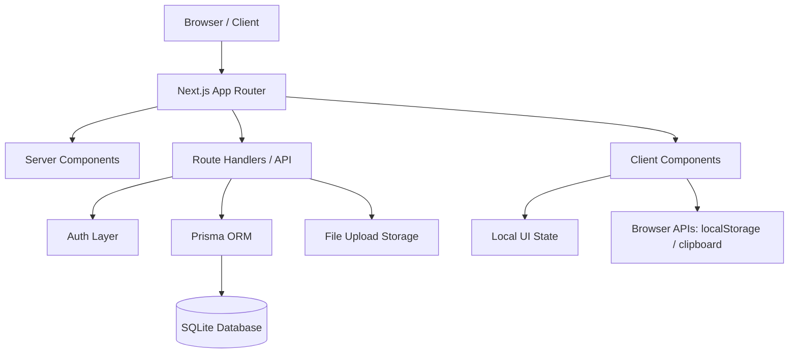
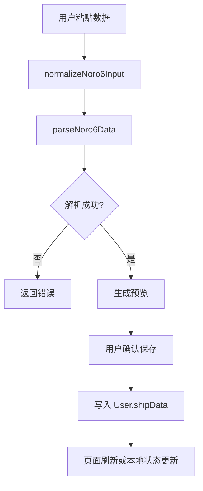
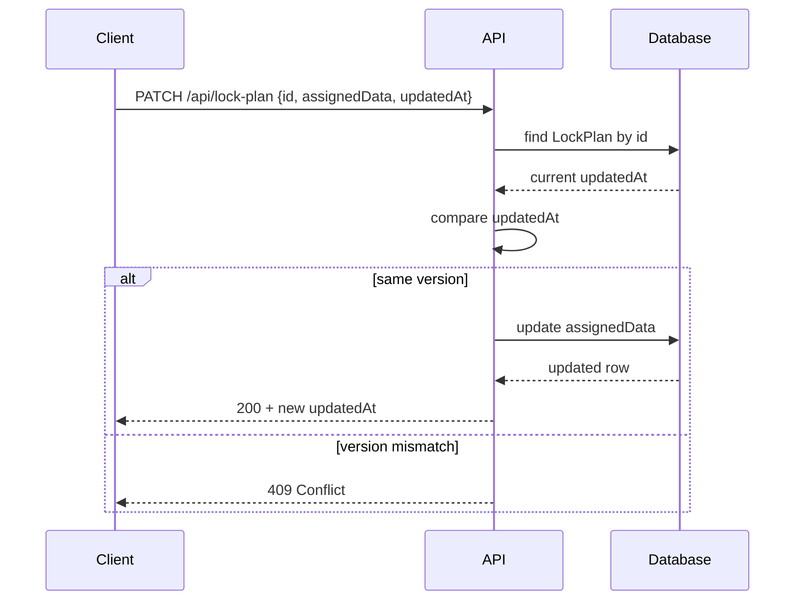
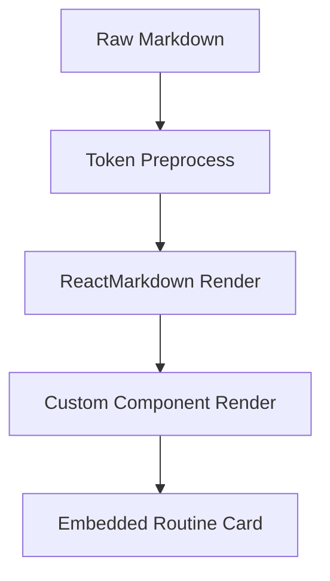
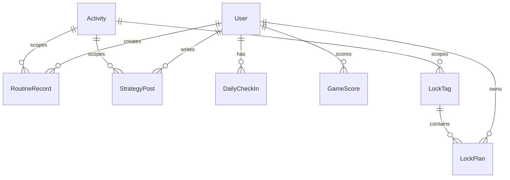
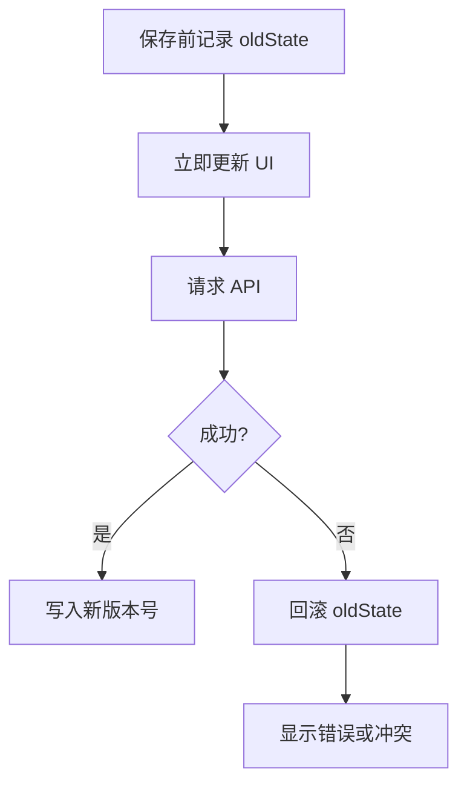

# KanColle Hub SDD（Software Design Document）

> 文档版本：v0.1  
> 文档类型：SDD / 软件设计文档  
> 项目名称：KanColle Hub  
> 技术定位：基于 Next.js 的小群舰队协作 Web App  
> 当前技术栈：Next.js App Router / TypeScript / Prisma / SQLite / Tailwind CSS / JWT Auth  
> 本文用途：指导系统架构、模块拆分、数据模型、接口设计、状态管理、性能、安全与后续重构  

---

## 0. 文档范围

本文描述 KanColle Hub 的软件设计方案，覆盖：

1. 系统目标与边界。
2. 总体架构。
3. 前端模块设计。
4. 后端模块设计。
5. 数据模型。
6. API 设计。
7. 状态与并发控制。
8. 安全设计。
9. 性能设计。
10. 错误处理与可观测性。
11. 部署与迁移。
12. 测试策略。
13. 后续演进路线。

本文不包含具体实现代码，但会定义推荐结构、接口约定、模块职责和工程规范。

---

## 1. 系统概述

### 1.1 系统名称

KanColle Hub

### 1.2 系统定位

KanColle Hub 是一个面向小群提督的协作工具，用于：

- 用户登录与身份识别。
- 上传和解析 noro6 舰队数据。
- 查看舰船与装备库存。
- 按活动或日常范围管理锁船标签。
- 多用户锁船规划。
- 周回作业卡记录与阵容编辑。
- 攻略档案发布与阵容卡嵌入。
- 个人头像、背景、签到、小游戏等轻量附属功能。

### 1.3 主要约束

| 约束 | 说明 |
|---|---|
| 使用场景 | 个人小群，不是公开大平台 |
| 并发规模 | 低到中等，活动期间集中使用 |
| 数据来源 | 用户手动导入 noro6 数据 |
| 数据库 | 当前 SQLite，后续可迁移 PostgreSQL |
| UI | 深色作战终端风格 |
| 核心优先级 | 锁船协作与数据可信度优先 |

---

## 2. 当前技术栈

| 层 | 技术 |
|---|---|
| Web 框架 | Next.js 14 App Router |
| 语言 | TypeScript |
| UI | React 18 |
| 样式 | Tailwind CSS |
| ORM | Prisma |
| 数据库 | SQLite |
| 认证 | bcryptjs + jose JWT |
| 数据校验 | Zod |
| Markdown | react-markdown |
| 工具脚本 | tsx |
| 包管理 | npm |

---

## 3. 总体架构

### 3.1 架构模式

系统采用单体 Next.js 应用架构：



### 3.2 设计原则

1. Server Components 负责初始数据读取和权限校验。
2. Client Components 负责复杂交互、拖拽、弹窗、编辑器、搜索筛选。
3. API Route Handlers 负责数据变更、校验、鉴权、并发控制。
4. Prisma 作为唯一数据库访问层。
5. 锁船等多人协作场景必须使用乐观并发控制。
6. UI 组件应从业务页面中抽离，形成统一设计系统。
7. 活动范围应作为核心上下文贯穿锁船、作业卡和攻略。

---

## 4. 目录结构建议

推荐结构：

```txt
src/
  app/
    layout.tsx
    globals.css
    page.tsx
    (auth)/
      login/
    (protected)/
      layout.tsx
      home/
      dashboard/
      lock-plan/
      routine/
      strategy/
      profile/
    api/
      auth/
      activities/
      lock-plan/
      lock-tags/
      routine/
      strategy/
      users/
      upload/
  components/
    common/
    ui/
    layout/
    data-center/
    lock-plan/
    routine/
    strategy/
    profile/
    games/
  lib/
    auth/
    prisma/
    validators/
    activity/
    noro6/
    master-data/
    lock-plan/
    storage/
    errors/
    permissions/
  prisma/
    schema.prisma
    migrations/
    seed.ts
  public/
```

当前项目已经存在类似结构，后续重构重点是：

- 将 `common` 中的布局组件进一步拆成 `layout` 与 `common`。
- 将业务工具函数按领域拆分。
- 将 UI 原子组件统一设计 token。
- 将 API 校验和权限逻辑集中化。

---

## 5. 运行时分层

### 5.1 前端层

职责：

- 页面渲染。
- 客户端交互。
- 表单状态。
- 弹窗与选择器。
- 拖拽。
- 本地筛选和排序。
- UI 状态反馈。

不负责：

- 权限最终判断。
- 数据完整性保障。
- 可信保存。
- 高风险操作的最终校验。

### 5.2 API 层

职责：

- 鉴权。
- 输入校验。
- 权限校验。
- 数据库读写。
- 乐观并发控制。
- 文件上传处理。
- 统一错误响应。

### 5.3 数据层

职责：

- 表结构。
- 索引。
- 关系约束。
- 唯一约束。
- 迁移。
- 数据清理和备份。

### 5.4 领域服务层

建议逐步抽出领域服务：

```txt
lib/services/
  activity-service.ts
  lock-plan-service.ts
  routine-service.ts
  strategy-service.ts
  ship-data-service.ts
  upload-service.ts
  audit-service.ts
```

好处：

- API Route Handler 保持薄。
- 业务规则集中。
- 便于测试。
- 后续迁移到其他后端架构更容易。

---

## 6. 领域模块设计

## 6.1 Auth / 用户认证模块

### 6.1.1 职责

- 用户登录。
- 用户注册或初始化。
- PIN / 密码校验。
- JWT 创建与验证。
- 保护页面访问。
- 获取当前用户。

### 6.1.2 当前能力

- 使用 bcryptjs 存储哈希后的 pinCode。
- 使用 jose 处理 JWT。
- 受保护页面通过服务端校验当前用户。

### 6.1.3 建议接口

| 函数 | 说明 |
|---|---|
| `requireCurrentUser()` | 服务端强制获取当前用户，未登录则跳转 |
| `getCurrentUser()` | 获取当前用户，允许为空 |
| `createSession(user)` | 创建 JWT 和 Cookie |
| `destroySession()` | 清除 Cookie |
| `verifyPassword(input, hash)` | 校验 PIN 或密码 |

### 6.1.4 安全要求

- Cookie 使用 `httpOnly`。
- 生产环境启用 `secure`。
- SameSite 至少为 `lax`。
- 登录失败不暴露具体用户是否存在。
- PIN 不能明文存储。
- 所有 API 变更操作必须再次校验用户身份。

---

## 6.2 User / 用户资料模块

### 6.2.1 职责

- 用户名。
- 头像。
- 背景图。
- 舰队数据。
- 签到食物值。
- 游戏分数关联。

### 6.2.2 设计要求

- 用户名唯一。
- 头像和背景图 URL 需要校验。
- 舰队数据可能很大，应考虑长度和解析成本。
- 背景图只影响视觉，不应影响核心页面可读性。

### 6.2.3 后续建议

- 增加 `role` 字段：`member / planner / admin`。
- 增加 `lastShipDataUpdatedAt` 字段。
- 增加 `preferences` JSON 字段保存 UI 偏好。
- 增加数据导出能力。

---

## 6.3 Activity / 活动范围模块

### 6.3.1 职责

- 创建活动。
- 切换当前活动。
- 区分日常和活动。
- 管理活动是否活跃。
- 控制锁船标签、作业卡、攻略的数据范围。

### 6.3.2 设计要求

- 日常范围使用 `activityId = null` 或约定的 daily scope。
- 活动范围使用具体 `activityId`。
- 所有相关数据查询必须包含活动条件。
- 页面 URL 应保留 `activityId`。
- 顶栏应持有当前活动上下文。

### 6.3.3 活动状态

建议增加状态：

| 状态 | 说明 |
|---|---|
| active | 当前可选 |
| archived | 已归档，仅查看 |
| hidden | 管理员隐藏 |
| deleted | 软删除，默认不显示 |

---

## 6.4 Ship Data / 舰队数据模块

### 6.4.1 职责

- 接收用户输入的 noro6 数据。
- 规范化输入。
- 解析舰船和装备。
- 存储原始数据。
- 生成舰船库存和装备库存。
- 提供给锁船和作业卡编辑器使用。

### 6.4.2 数据流



### 6.4.3 建议拆分

| 文件 | 职责 |
|---|---|
| `lib/noro6/parser.ts` | 解析原始数据 |
| `lib/noro6/normalizer.ts` | 规范化链接或文本 |
| `lib/noro6/derive-ship-stock.ts` | 从数据生成可选舰船 |
| `lib/noro6/derive-equipment-stock.ts` | 装备库存聚合 |
| `lib/noro6/types.ts` | 类型定义 |

### 6.4.4 错误类型

| 错误 | 说明 |
|---|---|
| `EMPTY_INPUT` | 输入为空 |
| `INVALID_JSON` | JSON 格式错误 |
| `UNSUPPORTED_FORMAT` | 不支持的数据格式 |
| `MISSING_SHIPS` | 未包含舰船数据 |
| `UNKNOWN_MASTER_ID` | 主数据缺失 |
| `TOO_LARGE` | 数据过大 |

---

## 6.5 Master Data / 主数据模块

### 6.5.1 职责

- 舰船名称。
- 舰种。
- 装备名称。
- 装备类型。
- 舰船基础属性。
- 改造链原始舰 ID。
- HP 数据。

### 6.5.2 设计要求

- 主数据读取应缓存。
- Lookup Map 应 memoize。
- 客户端组件避免重复构建大型 Map。
- 主数据更新应有权限控制。
- 更新失败不应破坏已有功能。

### 6.5.3 后续优化

- 生成静态 JSON。
- 使用版本号。
- 支持主数据更新时间显示。
- 支持增量更新。
- 提供未知 ID 报告。

---

## 6.6 Lock Plan / 锁船模块

### 6.6.1 职责

- 管理锁船标签。
- 管理用户在标签下的舰船分配。
- 支持同标签排序。
- 支持跨标签移动。
- 支持空槽位。
- 处理冲突。
- 乐观更新与回滚。
- 并发保存冲突检测。

### 6.6.2 核心数据

#### LockTag

表示一个活动范围下的锁船标签。

字段：

- `id`
- `activityId`
- `scopeKey`
- `name`
- `colorClass`
- `sortOrder`
- `isActive`

#### LockPlan

表示某个用户在某个标签下的舰船分配。

字段：

- `id`
- `userId`
- `tagId`
- `assignedData`
- `note`
- `sortOrder`
- `updatedAt`

### 6.6.3 assignedData 格式

当前可使用 JSON 字符串保存数组：

```json
[
  { "uniqueId": "ship-instance-1", "shipId": 123 },
  null,
  { "uniqueId": "ship-instance-2", "shipId": 456 }
]
```

说明：

- `uniqueId` 用于区分复制舰。
- `shipId` 用于查名称和舰种。
- `null` 表示空槽位。
- 保留空槽位可以支持用户手动排列。

### 6.6.4 领域规则

1. 同一个用户的同一艘舰不能同时存在于多个标签。
2. 同一标签内移动应保留槽位意图。
3. 跨标签移动应从源标签移除并放入目标标签。
4. 目标槽位已有舰船时应定义覆盖或交换规则。
5. 删除标签应优先停用，而不是物理删除。
6. 保存时必须检查 `updatedAt` 避免覆盖他人修改。

### 6.6.5 并发控制

推荐使用乐观锁：



### 6.6.6 批量移动事务

跨标签移动涉及两个 LockPlan：

- 源标签移除舰船。
- 目标标签插入舰船。

必须在同一事务中完成：

```txt
transaction:
  update source plan
  update target plan
```

如果任一失败，全部回滚。

### 6.6.7 前端状态

前端可维护：

```txt
tags
plansByUser
planIdsByUser
planVersionsByUser
shipsByUser
pickerState
conflictState
savingState
```

建议新增：

```txt
lastSyncedAt
dirtyPlanKeys
pendingMutations
operationHistory
```

---

## 6.7 Routine / 作业卡模块

### 6.7.1 职责

- 创建阵容记录。
- 编辑阵容记录。
- 删除阵容记录。
- 查看阵容记录。
- 按活动、搜索、海域、上传者筛选。
- 分页。
- FleetEditor 集成。

### 6.7.2 数据字段

RoutineRecord：

- `id`
- `userId`
- `activityId`
- `seaArea`
- `missionName`
- `airControl`
- `note`
- `imageUrl`
- `fleetData`
- `createdAt`
- `updatedAt`

### 6.7.3 查询设计

列表页查询条件：

```txt
activityId
search keyword
seaArea
uploaderId
page
pageSize
```

排序：

```txt
createdAt desc
```

建议未来支持：

- `updatedAt desc`
- 收藏优先。
- 海域阶段自然排序。
- 当前用户优先。

### 6.7.4 FleetData

`fleetData` 推荐继续以 JSON 字符串保存，但应有 schema 校验。

后续可考虑拆成结构化表：

```txt
RoutineFleet
RoutineFleetShip
RoutineFleetEquipment
```

但当前小群项目保留 JSON 更轻量。

### 6.7.5 自动保存

编辑已有作业卡时如使用自动保存，需要：

- debounce。
- 保存状态。
- 错误重试。
- 离开页面提示。
- 避免每次 FleetEditor 变动都立即请求。

---

## 6.8 Strategy / 攻略档案模块

### 6.8.1 职责

- 攻略创建。
- 攻略编辑。
- 攻略删除。
- Markdown 渲染。
- 图片插入。
- 作业卡嵌入。
- 阶段分组。

### 6.8.2 数据字段

StrategyPost：

- `id`
- `userId`
- `activityId`
- `phaseName`
- `title`
- `content`
- `fleetImageUrl`
- `airbaseImageUrl`
- `routineCardIds`
- `createdAt`
- `updatedAt`

### 6.8.3 Markdown 扩展

当前支持：

```txt
[img:url]
[card:id]
```

建议解析流程：



### 6.8.4 安全要求

- Markdown 链接必须加 `rel="noopener noreferrer"`。
- 图片 URL 需要校验协议。
- 禁止渲染危险 HTML。
- 如果未来启用 raw HTML，必须做 sanitize。
- 上传图片必须校验类型和大小。

### 6.8.5 后续扩展

| 功能 | 说明 |
|---|---|
| StrategyPostRevision | 攻略版本历史 |
| StrategyComment | 评论与补充 |
| StrategyTemplate | 攻略模板 |
| StrategyPin | 置顶攻略 |
| StrategyToc | 自动目录 |

---

## 6.9 Upload / 媒体上传模块

### 6.9.1 职责

- 上传头像。
- 上传背景图。
- 上传攻略截图。
- 返回可访问 URL。

### 6.9.2 安全要求

- 限制 MIME 类型：image/png、image/jpeg、image/webp、image/gif。
- 限制大小，例如 5MB。
- 随机文件名。
- 禁止使用用户原始文件名作为最终路径。
- 对 SVG 要么禁用，要么严格 sanitize。
- 返回 URL 前确认保存成功。

### 6.9.3 存储策略

第一阶段：

```txt
public/uploads/
```

后续：

- 本地 `uploads/` + 静态服务。
- S3 / R2 / MinIO。
- CDN。
- 定期清理未引用文件。

---

## 6.10 Daily Check-in / 小功能模块

### 6.10.1 职责

- 每日签到。
- 增加 food。
- 防止重复签到。
- 小游戏分数记录。

### 6.10.2 数据字段

DailyCheckIn：

- `userId`
- `date`
- `reward`

GameScore：

- `userId`
- `gameType`
- `score`

### 6.10.3 设计原则

- 保留趣味性。
- 不进入核心作战信息层级。
- 首页只展示轻量入口或个人状态。
- 不影响锁船和攻略主流程。

---

## 7. 数据模型设计

## 7.1 当前核心模型



## 7.2 User

| 字段 | 类型 | 说明 |
|---|---|---|
| id | String | 用户 ID |
| name | String unique | 用户名 |
| pinCode | String | 哈希后的 PIN |
| avatarUrl | String? | 头像 |
| backgroundUrl | String? | 背景 |
| shipData | String? | noro6 原始数据 |
| food | Int | 签到或小游戏资源 |
| createdAt | DateTime | 创建时间 |
| updatedAt | DateTime | 更新时间 |

建议新增：

| 字段 | 类型 | 说明 |
|---|---|---|
| role | String | 权限角色 |
| lastShipDataUpdatedAt | DateTime? | 舰队数据更新时间 |
| preferences | Json? | UI 偏好 |

## 7.3 Activity

| 字段 | 类型 | 说明 |
|---|---|---|
| id | String | 活动 ID |
| name | String unique | 活动名 |
| description | String? | 描述 |
| isActive | Boolean | 是否启用 |
| sortOrder | Int | 排序 |
| createdAt | DateTime | 创建时间 |
| updatedAt | DateTime | 更新时间 |

建议新增：

| 字段 | 类型 | 说明 |
|---|---|---|
| status | String | active / archived / hidden |
| startedAt | DateTime? | 活动开始 |
| endedAt | DateTime? | 活动结束 |
| createdById | String? | 创建者 |

## 7.4 LockTag

| 字段 | 类型 | 说明 |
|---|---|---|
| id | String | 标签 ID |
| activityId | String? | 活动范围 |
| scopeKey | String | 日常或活动 scope |
| name | String | 标签名 |
| colorClass | String | 样式类 |
| sortOrder | Int | 排序 |
| isActive | Boolean | 是否启用 |

重要约束：

```txt
unique(scopeKey, name)
index(activityId, sortOrder)
```

建议：

- 不要把 `colorClass` 直接绑定 Tailwind 类作为长期数据格式。
- 后续改为 `colorToken`，例如 `red / blue / amber / violet`。
- 前端再映射到实际类名，避免样式系统改动破坏历史数据。

## 7.5 LockPlan

| 字段 | 类型 | 说明 |
|---|---|---|
| id | String | 计划 ID |
| userId | String | 用户 |
| tagId | String | 标签 |
| assignedData | String | JSON 字符串 |
| note | String? | 备注 |
| sortOrder | Int | 排序 |
| createdAt | DateTime | 创建时间 |
| updatedAt | DateTime | 更新时间 |

重要约束：

```txt
unique(userId, tagId)
index(userId)
index(tagId)
```

建议新增：

| 字段 | 类型 | 说明 |
|---|---|---|
| updatedById | String? | 最近修改者 |
| version | Int | 显式版本号 |

## 7.6 RoutineRecord

| 字段 | 类型 | 说明 |
|---|---|---|
| id | String | 作业卡 ID |
| userId | String | 上传者 |
| activityId | String? | 活动范围 |
| seaArea | String | 海域 |
| missionName | String | 任务名 |
| airControl | Int | 制空 |
| note | String? | 备注 |
| imageUrl | String? | 图片 |
| fleetData | String? | 阵容 JSON |
| createdAt | DateTime | 创建 |
| updatedAt | DateTime | 更新 |

建议新增：

| 字段 | 类型 | 说明 |
|---|---|---|
| isDeleted | Boolean | 软删除 |
| isPinned | Boolean | 置顶 |
| copiedFromId | String? | 复制来源 |

## 7.7 StrategyPost

| 字段 | 类型 | 说明 |
|---|---|---|
| id | String | 攻略 ID |
| userId | String | 作者 |
| activityId | String? | 活动范围 |
| phaseName | String | 阶段 |
| title | String | 标题 |
| content | String | Markdown 内容 |
| routineCardIds | String? | 引用卡片 |
| createdAt | DateTime | 创建 |
| updatedAt | DateTime | 更新 |

建议新增：

| 字段 | 类型 | 说明 |
|---|---|---|
| isDeleted | Boolean | 软删除 |
| isPinned | Boolean | 置顶 |
| updatedById | String? | 最近修改者 |

## 7.8 AuditLog（建议新增）

用于记录高风险协作操作。

| 字段 | 类型 | 说明 |
|---|---|---|
| id | String | 日志 ID |
| actorId | String | 操作者 |
| action | String | 操作类型 |
| entityType | String | 实体类型 |
| entityId | String | 实体 ID |
| activityId | String? | 活动范围 |
| beforeJson | String? | 变更前 |
| afterJson | String? | 变更后 |
| createdAt | DateTime | 时间 |

操作类型示例：

```txt
LOCK_PLAN_UPDATE
LOCK_TAG_CREATE
LOCK_TAG_UPDATE
LOCK_TAG_DISABLE
ROUTINE_CREATE
ROUTINE_DELETE
STRATEGY_UPDATE
ACTIVITY_ARCHIVE
SHIP_DATA_UPDATE
```

---

## 8. API 设计

## 8.1 通用规范

### 8.1.1 请求

- JSON 请求使用 `Content-Type: application/json`。
- 文件上传使用 `multipart/form-data`。
- 所有变更请求必须要求登录。
- 所有输入必须经过 Zod 校验。

### 8.1.2 响应格式

成功：

```json
{
  "ok": true,
  "data": {}
}
```

兼容现状也可直接返回实体，但长期建议统一。

失败：

```json
{
  "ok": false,
  "error": {
    "code": "VALIDATION_ERROR",
    "message": "输入格式不正确",
    "details": {}
  }
}
```

### 8.1.3 状态码

| 状态码 | 场景 |
|---|---|
| 200 | 成功 |
| 201 | 创建成功 |
| 400 | 输入错误 |
| 401 | 未登录 |
| 403 | 无权限 |
| 404 | 资源不存在 |
| 409 | 并发冲突 |
| 413 | 文件或请求过大 |
| 500 | 未预期错误 |

---

## 8.2 Auth API

| 方法 | 路径 | 说明 |
|---|---|---|
| POST | `/api/auth/login` | 登录 |
| POST | `/api/auth/logout` | 退出 |
| PATCH | `/api/auth/avatar` | 更新头像 |
| PATCH | `/api/auth/background` | 更新背景 |

### PATCH `/api/auth/background`

请求：

```json
{
  "backgroundUrl": "/uploads/bg.png"
}
```

响应：

```json
{
  "ok": true,
  "backgroundUrl": "/uploads/bg.png"
}
```

---

## 8.3 Activities API

| 方法 | 路径 | 说明 |
|---|---|---|
| GET | `/api/activities` | 获取活动列表 |
| POST | `/api/activities` | 创建活动 |
| PATCH | `/api/activities/:id` | 更新活动 |
| DELETE | `/api/activities/:id` | 归档或删除活动 |

### POST `/api/activities`

请求：

```json
{
  "name": "2026 春活",
  "description": "可选说明"
}
```

响应：

```json
{
  "ok": true,
  "activity": {
    "id": "activity_id",
    "name": "2026 春活"
  }
}
```

---

## 8.4 Ship Data API

| 方法 | 路径 | 说明 |
|---|---|---|
| GET | `/api/users/ship-data?userId=` | 获取指定用户舰队数据 |
| PATCH | `/api/users/ship-data` | 更新当前用户舰队数据 |
| GET | `/api/users/list` | 获取成员列表 |
| POST | `/api/ship-data/preview` | 解析预览，建议新增 |

### PATCH `/api/users/ship-data`

请求：

```json
{
  "shipData": "normalized noro6 data"
}
```

响应：

```json
{
  "ok": true,
  "updatedAt": "2026-06-16T12:00:00.000Z"
}
```

### POST `/api/ship-data/preview`（建议新增）

请求：

```json
{
  "input": "raw pasted text or url"
}
```

响应：

```json
{
  "ok": true,
  "preview": {
    "shipCount": 320,
    "equipmentCount": 1500,
    "unknownShipIds": [],
    "unknownEquipmentIds": []
  },
  "normalized": "..."
}
```

---

## 8.5 Lock Tags API

| 方法 | 路径 | 说明 |
|---|---|---|
| GET | `/api/lock-tags?activityId=` | 获取标签 |
| POST | `/api/lock-tags` | 新增标签 |
| PATCH | `/api/lock-tags` | 编辑标签 |
| DELETE | `/api/lock-tags?id=` | 停用或删除标签 |

### POST `/api/lock-tags`

请求：

```json
{
  "activityId": "activity_id_or_null",
  "name": "E1",
  "colorToken": "blue"
}
```

响应：

```json
{
  "ok": true,
  "tag": {
    "id": "tag_id",
    "name": "E1",
    "colorToken": "blue",
    "sortOrder": 1
  }
}
```

### DELETE `/api/lock-tags?id=...`

建议行为：

- 第一阶段可保留删除。
- 后续改为 `isActive = false`。
- 返回影响数量：

```json
{
  "ok": true,
  "disabled": true,
  "affectedPlans": 4
}
```

---

## 8.6 Lock Plan API

| 方法 | 路径 | 说明 |
|---|---|---|
| GET | `/api/lock-plan?activityId=` | 获取锁船数据 |
| POST | `/api/lock-plan` | 创建单个计划 |
| PATCH | `/api/lock-plan` | 更新单个计划 |
| PUT | `/api/lock-plan` | 批量更新计划 |

### PATCH `/api/lock-plan`

请求：

```json
{
  "id": "plan_id",
  "userId": "user_id",
  "tagId": "tag_id",
  "assignedData": "[...]",
  "note": null,
  "updatedAt": "2026-06-16T12:00:00.000Z"
}
```

响应：

```json
{
  "ok": true,
  "plan": {
    "id": "plan_id",
    "updatedAt": "2026-06-16T12:01:00.000Z"
  }
}
```

冲突响应：

```json
{
  "ok": false,
  "error": {
    "code": "LOCK_PLAN_CONFLICT",
    "message": "该锁船规划刚被其他成员修改，请刷新页面后再编辑。"
  }
}
```

状态码：`409`

### PUT `/api/lock-plan`

用于跨标签移动等批量操作。

请求：

```json
{
  "plans": [
    {
      "id": "source_plan_id",
      "userId": "user_id",
      "tagId": "source_tag_id",
      "assignedData": "[...]",
      "updatedAt": "..."
    },
    {
      "id": "target_plan_id",
      "userId": "user_id",
      "tagId": "target_tag_id",
      "assignedData": "[...]",
      "updatedAt": "..."
    }
  ]
}
```

要求：

- 使用事务。
- 所有计划版本都匹配才保存。
- 任一冲突返回 409。
- 返回所有新版本。

---

## 8.7 Routine API

| 方法 | 路径 | 说明 |
|---|---|---|
| GET | `/api/routine` | 获取作业卡列表 |
| POST | `/api/routine` | 新建作业卡 |
| PATCH | `/api/routine` | 编辑作业卡 |
| DELETE | `/api/routine?id=` | 删除作业卡 |

### POST `/api/routine`

请求：

```json
{
  "activityId": "activity_id_or_null",
  "seaArea": "E2-3",
  "missionName": "P1削甲",
  "note": "可选备注",
  "imageUrl": null,
  "fleetData": "{...}"
}
```

响应：

```json
{
  "ok": true,
  "record": {
    "id": "routine_id"
  }
}
```

### PATCH `/api/routine`

要求：

- 只能作者或管理员编辑。
- 校验 `seaArea`、`missionName`。
- `fleetData` 如存在，应校验 JSON。

---

## 8.8 Strategy API

| 方法 | 路径 | 说明 |
|---|---|---|
| GET | `/api/strategy` | 获取攻略 |
| POST | `/api/strategy` | 发布攻略 |
| PATCH | `/api/strategy` | 编辑攻略 |
| DELETE | `/api/strategy?id=` | 删除攻略 |

### POST `/api/strategy`

请求：

```json
{
  "activityId": "activity_id_or_null",
  "phaseName": "E2-3",
  "title": "E2-3 甲攻略",
  "content": "## 路线\n...",
  "routineCardIds": null
}
```

响应：

```json
{
  "ok": true,
  "post": {
    "id": "strategy_id"
  }
}
```

---

## 8.9 Upload API

| 方法 | 路径 | 说明 |
|---|---|---|
| POST | `/api/upload` | 上传图片 |

请求：

```txt
multipart/form-data
file=<image>
```

响应：

```json
{
  "ok": true,
  "imageUrl": "/uploads/xxx.webp"
}
```

错误：

| code | 说明 |
|---|---|
| `FILE_TOO_LARGE` | 文件过大 |
| `UNSUPPORTED_FILE_TYPE` | 不支持的类型 |
| `UPLOAD_FAILED` | 保存失败 |

---

## 9. 前端设计

## 9.1 页面类型

| 页面 | 渲染策略 |
|---|---|
| 登录页 | Server + Client Form |
| 作战大厅 | Server initial data + Client widgets |
| 舰籍数据 | Server user data + Client parsing/search |
| 锁船矩阵 | Server initial data + Client complex state |
| 作业卡 | Server list + Client editor |
| 攻略档案 | Server posts + Client editor/preview |
| 个人设置 | Server user + Client upload/preferences |

## 9.2 组件分层

### UI 原子组件

```txt
Button
Input
Select
Textarea
Panel
Badge
Dialog
ConfirmDialog
Toast
Tooltip
Tabs
Table
EmptyState
StatusBar
```

### 业务组件

```txt
ActivitySwitcher
OperationHeader
ShipDataImportPanel
FleetRegistryTable
ArsenalInventoryTable
LockMatrix
LockTagBar
ShipPicker
ShipCell
RoutineEditor
RoutineList
FleetEditor
StrategyEditor
MarkdownRenderer
```

### 布局组件

```txt
AppShell
TopCommandBar
ModuleNav
PageHeader
SectionHeader
TwoPaneLayout
StickyToolbar
```

## 9.3 状态管理

当前可继续使用 React local state 和 URL 参数。

不建议第一阶段引入大型全局状态库，除非出现：

- 多页面共享复杂状态。
- 需要离线队列。
- 需要跨组件广播保存状态。
- 活动上下文在多处同步困难。

可选演进：

| 方案 | 用途 |
|---|---|
| React Context | 当前活动、用户偏好 |
| URLSearchParams | 页面筛选条件 |
| localStorage | UI 展开状态、锁船槽位显示数 |
| Server Action / API | 数据变更 |
| SWR / TanStack Query | 后续统一缓存和同步 |

## 9.4 URL 设计

推荐：

```txt
/home
/dashboard
/dashboard?viewerId=xxx
/lock-plan?activityId=xxx
/routine?activityId=xxx&page=1&seaArea=E2&uploaderId=xxx
/strategy?activityId=xxx
/profile
```

设计原则：

- 活动范围放入 URL。
- 筛选条件放入 URL。
- 弹窗状态一般不放 URL，除非需要分享。
- 详情页未来可独立路由：

```txt
/routine/:id
/strategy/:id
```

---

## 10. 视觉系统技术设计

## 10.1 Tailwind Token

建议在 `tailwind.config.ts` 或 CSS variables 中定义语义 token：

```txt
--color-bg-base
--color-bg-panel
--color-bg-panel-subtle
--color-border-base
--color-border-strong
--color-text-main
--color-text-muted
--color-primary
--color-success
--color-warning
--color-danger
```

### 10.1.1 不推荐

业务组件中大量散落：

```txt
bg-slate-800/70
border-slate-700/50
text-blue-400
shadow-black/10
```

### 10.1.2 推荐

统一封装：

```txt
surface-panel
surface-panel-strong
text-muted
border-subtle
status-success
status-warning
```

## 10.2 Panel 替代 Card

当前 Card 可保留，但建议新增 `Panel`：

| 属性 | 说明 |
|---|---|
| `title` | 中文标题 |
| `eyebrow` | 英文系统名 |
| `status` | 状态标签 |
| `variant` | default / dense / elevated / danger |
| `actions` | 右上角操作 |

Panel 比 Card 更符合“作战终端”风格。

## 10.3 主题系统

第一阶段：

- 固定深色主题。

第二阶段：

- 背景遮罩。
- 背景模糊。
- 低对比 / 高对比模式。
- 活动主题色。

第三阶段：

- 多主题 token。
- 用户偏好持久化。

---

## 11. 并发与一致性

## 11.1 高风险并发场景

| 场景 | 风险 |
|---|---|
| 两人同时编辑同一锁船计划 | 覆盖修改 |
| 跨标签移动 | 源和目标不一致 |
| 删除标签时有人正在编辑 | 数据丢失 |
| 编辑作业卡自动保存 | 覆盖旧内容 |
| 攻略多人编辑 | 后写覆盖先写 |

## 11.2 锁船并发控制

当前建议使用 `updatedAt` 作为版本。

更稳妥的后续方案：

- 增加 `version Int @default(1)`。
- 每次更新 `version + 1`。
- 客户端提交旧 version。
- API 用 `where: { id, version }` 更新。
- 更新数量为 0 则冲突。

优点：

- 避免 DateTime 精度问题。
- 语义清晰。
- 便于调试。

## 11.3 事务要求

必须事务化的操作：

- 跨标签移动舰船。
- 删除/停用标签并处理相关计划。
- 活动归档相关批量状态更新。
- 用户删除及其关联数据清理。
- 批量导入或迁移数据。

## 11.4 前端回滚

乐观更新流程：



---

## 12. 安全设计

## 12.1 认证

- JWT Cookie。
- httpOnly。
- sameSite。
- 生产环境 secure。
- token 过期时间合理。
- 退出时清除 Cookie。

## 12.2 权限

第一阶段最小规则：

| 资源 | 读取 | 修改 |
|---|---|---|
| User.shipData | 登录成员可读，或按小群策略全员可读 | 自己 |
| LockTag | 全员可读 | 管理员或规划者 |
| LockPlan | 全员可读 | 自己或规划者 |
| RoutineRecord | 全员可读 | 作者或管理员 |
| StrategyPost | 全员可读 | 作者或管理员 |
| Activity | 全员可读 | 管理员或规划者 |

如果当前暂不实现角色，至少做到：

- 用户只能编辑自己的作业卡和攻略。
- 高风险公共操作留 TODO 或限制给管理员。

## 12.3 输入校验

所有 API 使用 Zod。

校验项：

- 字符串长度。
- 必填字段。
- URL 协议。
- JSON 格式。
- activityId 是否存在。
- tagId 是否存在。
- userId 是否可访问。
- file size / MIME type。

## 12.4 XSS 防护

风险点：

- Markdown 内容。
- 图片 URL。
- 用户名称。
- 攻略链接。
- 上传文件。

措施：

- React 默认转义。
- 禁止 raw HTML Markdown。
- 链接加 `rel="noopener noreferrer"`。
- 图片 URL 限制协议。
- 上传文件限制类型。
- 不渲染用户提供的 HTML。

## 12.5 CSRF

如果使用 Cookie 鉴权，需考虑 CSRF。

简单方案：

- SameSite=Lax。
- 非幂等请求校验 Origin / Referer。
- 后续可加 CSRF token。

## 12.6 文件上传安全

- MIME 检查。
- 文件扩展名检查。
- 文件大小限制。
- 随机文件名。
- 禁止路径穿越。
- 不允许执行上传目录中的脚本。
- 可选图片转码为 webp。

---

## 13. 性能设计

## 13.1 性能热点

| 模块 | 风险 |
|---|---|
| 舰船表 | 数据多、排序筛选频繁 |
| 装备表 | 装备数量多 |
| 舰船选择弹窗 | 搜索与排序高频 |
| 锁船矩阵 | 用户 × 标签 × 槽位渲染 |
| Markdown 嵌入阵容 | FleetEditor 嵌套可能重 |
| noro6 解析 | 大 JSON 解析阻塞主线程 |

## 13.2 前端优化

- `useMemo` 构建 lookup。
- `useDeferredValue` 延迟搜索。
- 表格可增加虚拟列表。
- 锁船用户行可折叠。
- 舰船选择器分页或虚拟化。
- 大型解析放入 Web Worker。
- Markdown 嵌入阵容懒加载。
- 图片 lazy loading。

## 13.3 后端优化

- 常用查询加索引。
- API 查询只 select 必需字段。
- 活动范围查询必须过滤。
- 列表分页。
- 大文本字段避免不必要传输。
- 主数据可静态化或缓存。

## 13.4 数据库索引

当前已有索引基本合理。

建议关注：

```txt
RoutineRecord(activityId, createdAt)
RoutineRecord(activityId, seaArea)
StrategyPost(activityId, phaseName)
LockTag(activityId, sortOrder)
LockPlan(userId, tagId)
GameScore(gameType, score desc)
```

SQLite 对复杂全文搜索支持有限，攻略搜索可后续引入 FTS 或迁移 PostgreSQL。

---

## 14. 错误处理

## 14.1 错误分类

| code | 说明 |
|---|---|
| `UNAUTHORIZED` | 未登录 |
| `FORBIDDEN` | 无权限 |
| `VALIDATION_ERROR` | 输入错误 |
| `NOT_FOUND` | 资源不存在 |
| `CONFLICT` | 并发冲突 |
| `UPLOAD_FAILED` | 上传失败 |
| `PARSE_FAILED` | 数据解析失败 |
| `INTERNAL_ERROR` | 未预期错误 |

## 14.2 前端展示

| 错误类型 | 展示方式 |
|---|---|
| 表单校验 | 字段下方 |
| 保存失败 | Toast + 面板内提示 |
| 并发冲突 | Dialog + 状态栏 |
| 删除风险 | ConfirmDialog |
| 页面级错误 | ErrorState |
| 空数据 | EmptyState |

## 14.3 锁船冲突文案

```txt
锁船计划已被更新。
该标签的数据刚被其他成员修改。为避免覆盖，请刷新页面后再编辑。
```

可选操作：

- 刷新页面。
- 稍后处理。
- 复制当前修改。
- 后续支持合并。

---

## 15. 可观测性与审计

## 15.1 日志

建议记录：

- 登录失败。
- 数据导入。
- 锁船更新。
- 标签删除或停用。
- 作业卡删除。
- 攻略删除。
- 活动归档。
- 上传失败。

## 15.2 AuditLog

P2 增加数据库审计表。

用途：

- 追踪谁改了什么。
- 误删恢复。
- 活动复盘。
- 调试协作问题。

## 15.3 前端错误采集

小群工具可先不接第三方服务，但至少：

- `console.error` 不吞关键错误。
- API 返回可读错误。
- 生产环境可写入服务端日志。

---

## 16. 部署设计

## 16.1 环境变量

必需：

```txt
DATABASE_URL
UPLOAD_DIR
NEXT_PUBLIC_APP_NAME
```

可选：

```txt
MAX_UPLOAD_SIZE
NODE_ENV
ADMIN_USER_NAMES
```

## 16.2 本地开发

```txt
npm install
npx prisma migrate dev
npm run dev
```

## 16.3 生产部署

建议：

1. 构建应用。
2. 执行 Prisma migrate。
3. 配置持久化 SQLite 文件路径。
4. 配置 uploads 持久化目录。
5. 配置反向代理。
6. 配置 HTTPS。
7. 定时备份数据库和上传目录。

## 16.4 SQLite 注意事项

优点：

- 简单。
- 小群部署方便。
- 成本低。

风险：

- 写并发有限。
- 需要保证数据库文件持久化。
- 备份要明确。
- 容器部署时不能把数据库放进临时文件系统。

后续迁移 PostgreSQL 的条件：

- 用户数增加。
- 写并发明显变多。
- 需要更强查询能力。
- 需要全文搜索。
- 部署到 Serverless 环境不适合 SQLite。

---

## 17. 测试策略

## 17.1 单元测试

重点测试：

| 模块 | 测试内容 |
|---|---|
| noro6 parser | 不同输入格式、错误输入 |
| lock-plan helpers | parseAssignments、移动、删除、空槽位 |
| master-data lookup | ID 映射、未知 ID |
| validators | API 输入校验 |
| activity scope | 日常/活动解析 |
| permissions | 用户权限判断 |

## 17.2 组件测试

重点组件：

- ShipPicker。
- ShipCell。
- TagLockColumn。
- LockMatrix。
- FleetEditor。
- RoutineList。
- StrategyMarkdownRenderer。
- ConfirmDialog。

## 17.3 集成测试

场景：

1. 用户登录后进入首页。
2. 导入舰队数据。
3. 创建活动。
4. 新增锁船标签。
5. 分配舰船。
6. 跨标签移动舰船。
7. 两个客户端并发编辑触发 409。
8. 新建作业卡。
9. 攻略插入作业卡。
10. 上传图片插入攻略。

## 17.4 E2E 测试

推荐使用 Playwright。

关键流程：

- 初次使用流程。
- 活动期间锁船流程。
- 作业卡创建与查看。
- 攻略发布与渲染。
- 移动端查看当前锁船。

## 17.5 性能测试

- 500 艘舰船搜索。
- 3000 件装备聚合。
- 10 用户 × 12 标签 × 18 槽位锁船矩阵。
- 包含 20 个嵌入阵容卡的攻略页。
- 大 noro6 JSON 导入。

---

## 18. 迁移与重构计划

## 18.0 当前执行进度

> 更新日期：2026-06-16  
> 当前实现进度：Phase 5“协作可靠性”已完成第一版，核心协作写操作已接入角色权限、审计、软删除、锁船版本号和活动归档只读。

已落地改动：

- 新增依赖：`lucide-react`。
- 新增 UI 基础组件：
  - `src/components/ui/panel.tsx`
  - `src/components/ui/status-badge.tsx`
- 重构基础 UI 风格：
  - Button 去除上浮动效，改为硬边指令按钮。
  - Card 改为 `surface-panel` 风格。
  - Badge / AlertDialog 改为终端面板视觉。
  - `globals.css` 和 `tailwind.config.js` 增加语义 token。
- 重构 `AppShell`：
  - 主导航改为 lucide 图标 + 中文模块名 + 英文系统码。
  - 作业卡 / 攻略 / 锁船导航继续透传 `activityId`。
  - 新增 `/profile` 导航入口。
- `/home` 已改为轻量作战大厅：
  - 活动切换。
  - 成员数据同步摘要。
  - 锁船标签与已分配舰船摘要。
  - 最近作业卡。
  - 最近攻略。
  - 个人状态入口。
- `/profile` 已新增：
  - 头像设置。
  - 背景设置。
  - 签到粮食。
  - 小游戏入口。
- 页面标题命名已初步统一：
  - `DATA / FLEET REGISTRY`
  - `SORTIE BOARD / 作业卡`
  - `TACTICAL NOTES / 攻略档案`
  - `LOCK MATRIX / 锁船矩阵`
- 新增测试入口：
  - `package.json` 增加 `npm test`。
  - 当前测试命令为 `tsx --test "src/**/*.test.ts"`，先覆盖纯业务逻辑，后续再按风险补组件/E2E。
- 新增锁船矩阵领域 helper：
  - `buildLockMatrixSummary` 统计活动标签数、已分配舰船数、未导入数据成员数。
  - `buildLockMatrixSummary` 检测同一用户同一 `uniqueId` 在多个活动标签下重复锁定。
  - `getSaveStatusDisplay` 将 `idle / saving / synced / failed / conflict` 映射为终端状态文案和视觉等级。
- `LockPlanGodView` 已接入常驻状态面板：
  - 保存请求开始时进入 `saving`。
  - 保存成功后进入 `synced` 并记录 `lastSyncedAt`。
  - 409 时进入 `conflict`。
  - 网络或其他失败进入 `failed`。
  - 顶部展示 `TAGS / ASSIGNED / CONFLICT / NO DATA` 摘要。
- `LockPlanGodView` 已补齐 v0.3 交互：
  - 桌面端用户列 sticky，标签头 sticky。
  - 移动端提供当前用户标签 Tabs、轻量列表和操作菜单。
  - 分配、移除、排序、跨标签移动保存成功后提供短时前端撤销。
  - 标签停用确认前展示影响范围。
- `TagManager` 删除入口已从浏览器 `confirm` 改为项目 AlertDialog，并改为“停用标签”语义。
- 新增 noro6 解析预览领域函数 `buildNoro6Preview`，输出标准化数据、舰船/装备统计、未知 master ID、是否包含装备数据和相对上次导入的差异。
- 新增 `POST /api/ship-data/preview`，只解析和返回预览，不写数据库。
- `ShipDataCenter` 保存流程改为“解析预览 -> 确认更新”，并在他人视角禁用导入保存。
- `ShipDataCenter` 已显示 `lastShipDataUpdatedAt`，`/api/users/ship-data` GET 会返回对应更新时间。
- 攻略编辑器新增默认模板、实时 Markdown 预览、插入模板和作业卡搜索插入。
- 新增攻略 helper：`strategy-helpers.ts`，用于模板默认值和作业卡搜索过滤。
- 新增协作规则 helper：`collaboration.ts`，集中处理角色权限、软删除查询片段、归档只读和锁船版本冲突判断。
- 新增审计写入 helper：`audit.ts`，关键 API 写操作统一写入 `AuditLog`。
- `/api/lock-plan` 已从 `updatedAt` 乐观锁升级为显式 `version` 校验和自增，并记录 `updatedById`。
- `/api/lock-tags`、`/api/activities` 已限制为 `planner / admin` 管理，并接入归档只读和审计日志。
- `/api/routine`、`/api/strategy` 已切换为软删除，列表、筛选和攻略作业卡插入入口默认排除 `isDeleted=true`。
- `/api/users/ship-data` 更新存档时写入审计元信息，不记录完整 noro6 原文。
- 锁船矩阵前端已接收和提交 `LockPlan.version`，普通成员查看他人锁船行时为只读。
- seed 用户已分配角色：提督A 为 `admin`，提督B 为 `planner`，提督C 为 `member`。

已落地数据模型地基：

- `User.role String @default("member")`
- `User.lastShipDataUpdatedAt DateTime?`
- `Activity.status String @default("active")`
- `LockPlan.version Int @default(1)`
- `LockPlan.updatedById String?`
- `RoutineRecord.isDeleted Boolean @default(false)`
- `RoutineRecord.isPinned Boolean @default(false)`
- `RoutineRecord.copiedFromId String?`
- `StrategyPost.isDeleted Boolean @default(false)`
- `StrategyPost.isPinned Boolean @default(false)`
- `StrategyPost.updatedById String?`
- `AuditLog`

已落地 API 兼容改动：

- `/api/users/ship-data` 更新舰队数据时同步写入 `lastShipDataUpdatedAt = now()`。
- `/api/activities` 创建活动时写入 `status = "active"`。
- `activitySchema` 已允许 `status: active / archived / hidden`，但本轮不改变旧的 `isActive` 查询行为。
- `/api/lock-tags` 的 `DELETE` 行为改为停用标签：更新 `isActive=false`，并返回 `affectedPlans`。
- `/api/activities` 的 `DELETE` 行为改为活动归档：写入 `status=archived`、保留 `isActive=true` 以支持只读查看。
- 活动列表和活动解析已排除 `hidden`，但允许 `archived` 活动被打开查看。

迁移状态：

- 已新增手写 SQLite migration：`20260616133000_ops_console_foundation`。
- 已新增手写 SQLite migration：`20260616164000_collaboration_reliability`。
- 当前本机执行 `npx prisma migrate dev` 和 `prisma db push` 会触发 Prisma schema engine 空错误。
- `npx prisma validate` 与 `npx prisma generate` 均通过，schema 本身有效。

验证状态：

- `npm test` 通过，覆盖锁船矩阵摘要、保存状态文案、标签停用影响统计和移动端默认标签选择。
- `npm test` 通过，新增覆盖 noro6 解析预览统计、未知 ID、导入差异、纯舰船导入合并装备、攻略默认模板和作业卡搜索。
- `npm test` 通过，新增覆盖角色权限、归档只读、软删除查询片段和锁船版本冲突规则。
- `npm run lint` 通过，仅保留既有 `` 优化 warning。
- `npm run build` 通过。
- 本地 preview 已使用 seed 用户验证 `/home`、`/profile`、活动上下文导航透传、`/lock-plan` 桌面状态栏渲染和移动端锁船面板。
- 本地 preview 已使用 seed 用户验证 `/dashboard` 解析预览和 `/strategy` 实时预览、默认模板、作业卡搜索入口。

## 18.1 Phase 1：文档与命名统一

目标：

- 补齐 GDD / SDD。
- 统一模块命名。
- 梳理页面职责。
- 明确活动上下文。

改动风险：低。

## 18.2 Phase 2：设计系统重构

目标：

- 新增 Panel、StatusBadge、ConfirmDialog、Toast。
- 重构 Button/Input/Select/Textarea。
- 建立 CSS variables。
- AppShell 改为作战终端顶栏。
- 去除主导航 emoji 依赖。

改动风险：中低。

当前状态：

- 已完成：Panel、StatusBadge、Button、Card、Badge、AlertDialog、AppShell、导航图标化、基础 CSS variables。
- 部分完成：Input / Select / Textarea 仍保留旧实现，只受全局 token 间接影响；Toast 尚未实现。
- 后续收尾：补齐 Toast、ConfirmDialog 的业务封装，并逐步替换业务组件内散落的旧卡片/emoji/硬编码颜色。

## 18.3 Phase 3：锁船矩阵重构

目标：

- Sticky 用户列和标签头。
- 保存状态常驻。
- 移动端替代操作。
- 标签删除改为停用或强确认。
- 操作撤销。

改动风险：中高。

待执行技术清单：

- 在 `LockPlanGodView` 中加入常驻保存状态模型：（已完成）
  - `idle / saving / synced / failed / conflict`
  - 显示最近同步时间。
  - 冲突时提供刷新入口。
- 在 `LockPlanGodView` 中展示矩阵摘要：（已完成）
  - 活动标签数。
  - 已分配舰船数。
  - 重复锁定冲突数。
  - 未导入数据成员数。
- 重构矩阵布局：
  - 桌面端 sticky 用户列。（已完成）
  - 桌面端 sticky 标签头。（已完成）
  - 标签头显示标签名、数量、状态。（已完成）
  - 用户行显示头像、名称、数据导入状态。（已完成）
- 删除标签接口从物理删除优先改为停用或强确认：
  - API `DELETE` 已改为 `isActive = false`。
  - 前端已使用确认弹窗展示影响范围。
- 移动端新增替代交互：
  - 默认只显示当前用户。（已完成）
  - 标签 Tabs 切换。（已完成）
  - 已分配舰船点击打开操作菜单。（已完成）
  - 支持移动到其他标签、调整位置、移除、查看详情。（已完成移动、排序、移除；详情以操作弹窗元信息展示）
- 撤销：
  - 第一阶段做前端短时撤销。（已完成）
  - 后续结合软删除或 AuditLog 做服务端恢复。

## 18.4 Phase 4：数据中心升级

目标：

- 导入解析预览。
- 数据更新时间。
- 未知 ID 报告。
- 舰船/装备表格体验优化。
- 视角切换更清晰。

改动风险：中。

执行状态：已完成第一版。

待执行技术清单：

- 新增 `/api/ship-data/preview`：（已完成）
  - 输入 raw noro6 文本或链接。
  - 返回 normalized 数据、舰船数、装备数、未知舰船 ID、未知装备 ID。
  - 不写数据库。
- 拆分 noro6 逻辑：
  - parser / normalizer / derive-ship-stock / derive-equipment-stock / types。（部分完成：预览逻辑已进入 `noro6.ts`，后续再做文件级拆分）
- 数据中心保存流程改为：
  - 输入。
  - 实时或按钮触发解析。
  - 展示预览。
  - 用户确认后调用 `/api/users/ship-data` 保存。（已完成）
- 舰籍数据页展示 `lastShipDataUpdatedAt`，并标识当前视角用户。（已完成）
- 舰船/装备表增加更稳定的搜索、筛选、排序状态。
- 攻略编辑器升级：
  - 左编辑右预览。（已完成第一版）
  - 默认模板。（已完成）
  - 阵容卡搜索插入。（已完成）
  - Markdown 渲染继续禁用 raw HTML。

## 18.5 Phase 5：协作可靠性（已完成第一版）

目标：

- AuditLog。
- 软删除。
- 角色权限。
- 版本号并发控制。
- 活动归档。

改动风险：中高。

待执行技术清单：

- 新增 `AuditLog` 模型，记录 `actorId`、`action`、`entityType`、`entityId`、`activityId`、前后状态 JSON 和创建时间。（已完成）
- 新增软删除字段：`RoutineRecord.isDeleted/isPinned/copiedFromId`、`StrategyPost.isDeleted/isPinned/updatedById`。（已完成）
- 权限体系落地：`member / planner / admin`，公共标签、活动归档、他人内容编辑/删除等高风险操作必须校验角色。（已完成第一版）
- 锁船并发控制升级：`LockPlan.version Int @default(1)`，API 校验版本并在成功保存后递增，响应返回新 version。（已完成）
- 活动状态升级：`Activity.status` 成为主状态，活动归档后默认只读，`hidden` 不进入活动列表。（已完成归档只读第一版）
- 数据导出：个人数据导出、活动复盘导出，后续可扩展为 Markdown / JSON / ZIP。（未做，作为后续增强保留）

---

## 19. 关键设计决策记录

### DDR-001：继续使用单体 Next.js 架构

原因：

- 项目规模适合。
- 小群部署简单。
- Server Components + API Route 足够。
- 减少运维复杂度。

代价：

- 后续复杂实时协作能力有限。
- API 和页面耦合需要通过服务层缓解。

### DDR-002：锁船计划使用 JSON 保存槽位

原因：

- 开发快。
- 保留空槽位容易。
- 与当前实现兼容。

代价：

- 数据库无法直接查询单艘舰的锁船状态。
- 需要应用层解析。
- 后续如要复杂统计，可能需要结构化表。

未来方案：

```txt
LockAssignment:
  id
  planId
  uniqueId
  shipId
  slotIndex
```

### DDR-003：活动范围使用 activityId

原因：

- 与作业卡、攻略、锁船标签统一。
- URL 可携带。
- 查询简单。

注意：

- 日常范围需要统一抽象，避免到处特判 null。

### DDR-004：视觉系统采用作战终端风格

原因：

- 区分泛后台。
- 符合舰队协作工具气质。
- 提高产品身份。

代价：

- 需要重新设计基础组件。
- 必须控制可读性，不能过度主题化。

---

## 20. 开放问题

1. 是否需要管理员/规划者角色？
2. 是否允许所有成员查看他人完整舰队数据？
3. 删除标签应该永久删除还是停用？
4. 作业卡是否需要公开复制功能？
5. 攻略是否需要多人编辑？
6. 图片上传是否需要外部存储？
7. 活动归档后是否允许继续编辑？
8. 是否需要从 SQLite 迁移到 PostgreSQL？
9. 移动端锁船编辑要支持到什么程度？
10. 是否需要导出活动复盘报告？

---

## 21. 附录：推荐错误码

```txt
AUTH_REQUIRED
FORBIDDEN
VALIDATION_ERROR
RESOURCE_NOT_FOUND
LOCK_PLAN_CONFLICT
ACTIVITY_NOT_FOUND
TAG_NOT_FOUND
ROUTINE_NOT_FOUND
STRATEGY_NOT_FOUND
SHIP_DATA_EMPTY
SHIP_DATA_PARSE_FAILED
MASTER_DATA_MISSING
UPLOAD_TOO_LARGE
UPLOAD_TYPE_UNSUPPORTED
UPLOAD_FAILED
INTERNAL_ERROR
```

---

## 22. 附录：推荐状态标签

```txt
SYNCED / 已同步
SAVING / 同步中
FAILED / 同步失败
CONFLICT / 冲突
NO DATA / 未导入
READY / 就绪
DRAFT / 草稿
ARCHIVED / 已归档
LOCKED / 已锁
VIEW ONLY / 只读
```

---

## 23. 附录：推荐业务事件

```txt
user.login
user.logout
user.avatar.update
user.background.update
ship_data.preview
ship_data.update
activity.create
activity.archive
lock_tag.create
lock_tag.update
lock_tag.disable
lock_plan.update
lock_plan.conflict
routine.create
routine.update
routine.delete
strategy.create
strategy.update
strategy.delete
upload.image
checkin.daily
game.score.create
```

---

## 24. 最终技术原则

1. **所有数据变更必须经过服务端校验。**
2. **多人协作数据必须有版本或时间戳并发控制。**
3. **高风险操作必须支持确认，后续尽量支持恢复。**
4. **业务逻辑不要散落在组件里，应逐步沉淀到领域服务。**
5. **活动范围必须贯穿查询、创建和展示。**
6. **视觉系统应由 token 和组件驱动，不应靠页面内硬编码拼样式。**
7. **SQLite 可以继续用，但必须认真处理备份和未来迁移路径。**
8. **移动端不是桌面端缩小，而是单独设计的轻量流程。**
9. **主题感服务于可读性，不能反过来破坏数据阅读。**
10. **KanColle Hub 的软件架构目标是：小而稳、易部署、协作可信、后续可演进。**
